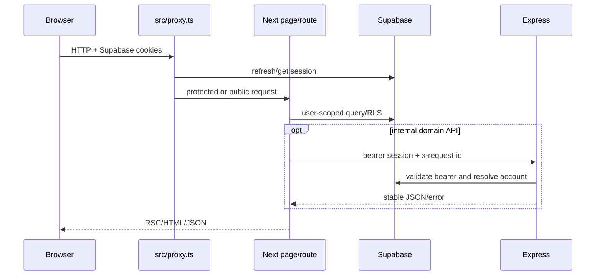

# Current `main` architecture

> Pinned to `28cd0f3f7b3f5b106162bf3811abc1d5d99f376b`, `wacrm@0.8.0`.

## Runtime topology

WACRM is a TypeScript repository with three runtime surfaces:

1. **Next.js 16.2.6 / React 19.2.4** in `src/`: UI, Supabase session boundary, route handlers, public API, provider webhooks and same-origin BFF.
2. **Express 5.2.1** in `server/`: internal API with Helmet, Pino HTTP logs, health probes, request context and independently checked bearer authentication. Account is the first extracted domain.
3. **MCP package** in `mcp-server/`: standalone tool server that calls `/api/v1` with a scoped WACRM API key. Writes and broadcast tools are opt-in.

`pnpm dev`/`start` supervise web and API with `concurrently`. `scripts/run-web.mjs` selects `WEB_PORT`; Express binds `API_HOST`/`API_PORT`. `/api/service/[...path]` resolves `EXPRESS_API_URL` or derives the internal URL and forwards an authenticated request with a request ID.

## Request boundaries

`src/proxy.ts` is the Next 16 auth boundary. Dashboard routes require a session. Auth callback, join/invitation, provider webhooks, public APIs and BFF have route-specific authentication. Service-role clients in AI, automation, flow, channel and WhatsApp server modules bypass RLS and therefore must perform explicit account checks.

## Domain map

| Domain               | Main source                                                               | Persistence/state                                             | Status                                                                      |
| -------------------- | ------------------------------------------------------------------------- | ------------------------------------------------------------- | --------------------------------------------------------------------------- |
| Auth/accounts        | `src/lib/auth`, `src/lib/account`, `/api/account`, Express account router | Supabase Auth, `profiles`, `accounts`, membership/invitations | Implemented; live RLS verification blocked.                                 |
| Dashboard            | `src/lib/dashboard`, dashboard components/API                             | Supabase projections plus SWR                                 | Implemented.                                                                |
| Contacts             | contact components, `src/lib/data/contacts`, v1/workspace APIs            | Supabase; mock repository for demo paths                      | Implemented with demo boundary.                                             |
| Inbox/messages       | inbox components/hooks, WhatsApp and v1 APIs                              | Supabase, Realtime, Storage, SWR                              | Meta-centric implementation.                                                |
| Pipelines            | `src/lib/pipelines`, pipeline components/routes                           | Supabase repository plus SQLite/demo variants                 | Mixed; production convergence incomplete.                                   |
| Broadcasts/templates | broadcast UI, WhatsApp routes/libs                                        | Supabase + Meta                                               | Implemented for Meta; generic channels partial.                             |
| Automations          | automation builder, engine/admin client, cron                             | Supabase tables and pending executions                        | Implemented; instance/external scheduler assumptions.                       |
| Flows                | flow editor/state/engine/routes                                           | Supabase graph/run tables; local editor state                 | Implemented.                                                                |
| AI                   | `src/lib/ai`, `/api/ai`, agents/settings                                  | encrypted BYO provider config, knowledge/pgvector, usage      | Implemented for OpenAI/Anthropic paths; provider calls require credentials. |
| Channels             | `src/lib/channels`, settings API/UI, webhook boundaries                   | `channel_connections` and identity/webhook tables             | Foundation implemented; parity partial.                                     |
| Notifications        | notification page/hook/API                                                | notifications/preferences/deliveries                          | Base implementation; full delivery center partial.                          |
| Bookings/agents      | page/component surfaces                                                   | limited source-controlled domain depth                        | Early/partial UI.                                                           |
| Public API/webhooks  | `/api/v1`, api-key/webhook libs                                           | hashed keys, scoped access, signed deliveries                 | Implemented additive surface.                                               |

## Provider maturity

| Provider        | Settings/contracts                        | Send                | Receive               | Operational classification                         |
| --------------- | ----------------------------------------- | ------------------- | --------------------- | -------------------------------------------------- |
| Meta WhatsApp   | Mature legacy + neutral schema            | Implemented         | HMAC-verified webhook | Most complete.                                     |
| SMTP            | Encrypted settings and Nodemailer adapter | Implemented adapter | N/A                   | Partial until live connection/schema verification. |
| Twilio WhatsApp | Registry/settings/signature boundary      | Partial             | Webhook boundary      | Not end-to-end complete.                           |
| Resend          | Registry/settings/adapter foundation      | Partial             | Not complete          | Staged.                                            |
| Gmail           | Types/capabilities                        | Not complete        | Not complete          | Target-only beyond foundation.                     |
| Microsoft 365   | Types/schema constraint                   | Not complete        | Not complete          | Target-only beyond foundation.                     |

No provider is allowed to silently fall back to another.

## Routing model

Canonical feature URLs are `/dashboard`, `/inbox`, `/contacts`, `/pipelines`, `/broadcasts`, `/automations`, `/flows`, `/agents`, `/bookings`, `/notifications`, and `/settings`. `/bigin/org/[accountId]/...` and `/org/[accountId]/...` remain compatibility routes. `src/lib/routing/routes.ts` and `src/lib/routes/dashboard-routes.ts` represent competing routing conventions and should not be assumed equivalent without checking callers.

## Key architectural risks

- Live migration/RLS state is unverified.
- Service-role paths require explicit account scoping because they bypass RLS.
- Process-local cache/rate-limit state is not multi-instance durable.
- Pipeline SQLite/demo paths are not Supabase production authority.
- Two lockfiles (`pnpm-lock.yaml`, `package-lock.json`) can drift; scripts establish pnpm as operational convention.
- Provider-neutral contracts are broader than end-to-end transports.
