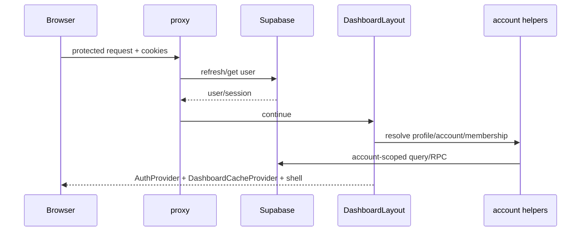

# Pages and user flows

All paths are App Router paths under `src/app`. Parenthesized route groups do not appear in URLs. Dashboard pages inherit the authenticated dashboard layout and account context unless noted.

## Public and authentication pages

| URL | Page/method | Flow |
| --- | --- | --- |
| `/` | `RootPage` | Resolves entry behavior and sends users toward the application/auth surface. |
| `/login` | `LoginPage` | Validates Supabase public configuration, accepts credentials, calls Supabase password sign-in, then enters the protected application. The observed 403 “Signup is not allowed” is a Supabase Auth project policy response, not an MCP connection error. |
| `/signup` | `SignupPage` | Calls Supabase sign-up; succeeds only if project Auth allows signups. Email confirmation behavior is controlled in Supabase. |
| `/forgot-password` | `ForgotPasswordPage` | Requests a Supabase recovery email with the configured site/callback URL. |
| `/reset-password` | `ResetPasswordPage` | Consumes recovery session and updates the password. |
| `/auth/callback` | route `GET` | Exchanges Supabase auth code for a cookie-backed session and redirects. |
| `/join/[token]` | join page | Calls invitation peek, authenticates if needed, then redeems into the target account. |

## Canonical application pages

| URL | Main composition | Data/actions and states |
| --- | --- | --- |
| `/dashboard` | `DashboardWorkspace`, metric cards/charts/activity/quick actions | SWR `GET /api/v1/dashboard`; loading skeleton, error and empty states; navigation to core workspaces. |
| `/inbox` | conversation list, thread, composer, contact sidebar | Conversation/message queries, Realtime hooks, media relay, send/react/quick-reply APIs; optimistic send and unread updates. |
| `/contacts` | `ContactWorkspace`, form/filter/import/detail/custom fields | Workspace contacts API and repository filters; create/update/delete/import/tag flows; loading/empty/error handling. |
| `/pipelines` | pipeline workspace/board/sheets/editor/settings | Repository runtime selects Supabase/SQLite/demo behavior; drag/drop and editor mutate snapshots and SWR cache. |
| `/broadcasts` | campaign list | Reads campaigns/status; links to creation/detail. |
| `/broadcasts/new` | four-step builder | Choose template → audience → personalize → schedule/send → WhatsApp broadcast route. |
| `/broadcasts/[id]` | detail/status | Campaign and recipient delivery state; status normalization/counters. |
| `/automations` | automation list | CRUD through `/api/automations`; enablement and navigation. |
| `/automations/new` | `AutomationBuilder` | Resource context loads tags/templates/pipelines; validates trigger/action tree; persists automation and steps. |
| `/automations/[id]/edit` | builder with existing graph/tree | Fetch → edit → validate → PATCH; duplicate/delete routes are separate actions. |
| `/automations/[id]/logs` | execution log view | Reads execution history and pending outcomes. |
| `/flows` | flow list/templates | CRUD and template creation; activate/edit/run navigation. |
| `/flows/[id]` | `FlowEditorShell`, canvas/list, config form, validation panel | `FlowEditorProvider` owns graph/editor state; PUT saves nodes/edges; activate validates; view mode is browser-local preference. |
| `/flows/[id]/runs` | run history | `GET /api/flows/[id]/runs`; event/run inspection. |
| `/agents` | AI playground and usage | Calls playground/test/config/usage/knowledge APIs; requires configured provider credentials. |
| `/bookings` | booking workspace | Early feature surface; source has less persisted domain depth than core CRM. |
| `/notifications` | notification list | SWR/read API; PATCH marks state; unread hook keeps shell badge synchronized. |
| `/settings` | rail/sections for profile, account, members, security, appearance, WhatsApp, channels, templates, replies, tags, fields, AI and API keys | Each panel calls its domain API/Supabase method; unavailable provider lifecycle is shown rather than silently emulated. |

## Compatibility pages

`/bigin/org/[accountId]/home/...` supports legacy contact/deal navigation. `/org/[accountId]/pipelines/...` supports older account-prefixed enterprise pipeline routes. They resolve awaited Next 16 params, validate account context, and compose/redirect into current workspaces; callers should prefer canonical routes.

## Principal end-to-end flows

### Session and account resolution

### Inbound message

Meta signs a webhook; `verifyMetaWebhookSignature` rejects an absent/bad secret. The server-only route uses an admin client, normalizes sender/message, resolves or creates contact and conversation, inserts message/media state, then dispatches Flow → Automation → AI behavior. Supabase Realtime subscriptions update the inbox; Meta retries non-success webhook responses.

### Outbound message

Composer validates text/template/media/reply payload, inserts an optimistic UI record, then calls `/api/whatsapp/send`. The route gets the authenticated user/account, rate-checks, loads/decrypts WhatsApp credentials, builds the correct Meta payload, sends it, persists the provider ID/status and returns JSON. Realtime replaces the optimistic record; failures mark it failed.

### Account invitation

Owner/admin opens settings → `POST /api/account/invitations` validates role/email/host and creates an invitation → invite URL points to `/join/[token]` → peek RPC exposes safe metadata → authenticated redeem RPC creates membership atomically → dashboard account context refreshes.

### Flow execution

Editor mutates local graph → validator checks nodes/edges/config → save writes `flows`/`flow_nodes` → activate marks runnable → trigger creates `flow_runs` and events → action nodes execute → wait nodes persist continuation → secret-protected cron drains due runs → run page reads event history.

### Public API and MCP

Operator creates an API key in Settings → only hash/scopes are persisted and raw key is displayed once → MCP reads `WACRM_BASE_URL`/`WACRM_API_KEY` → tool validates input → API client calls `/api/v1` → API context authenticates hash, scope and account → domain method queries Supabase → response returns through MCP. Write/broadcast tools additionally require MCP opt-in flags.
